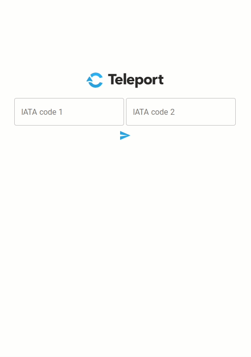
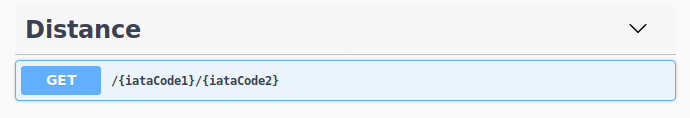

# .NET Core 2.2 REST Api

<p align="center">
  
</p>

## How to run this?

You will need [Docker](https://docs.docker.com/install/) and [Docker Compose](https://docs.docker.com/compose/install/) installed in your system. WIth docker installed you can simply run:

```bash
$ docker-compose up
```

After that command succeeds you can visit:

* `http://localhost:80`: To use a React app that interacts with the API.
* `http://localhost:8080`: The API itself. If you visit `/` the [Swagger](https://swagger.io/) documentation will be shown.

## What has been done?

The `AirportApi` folder contains a .ASP NETCORE 2.2 project. It implements a single GET method for fetching the distance between two IATA codes. The controllers is located at `AirportApi/Controllers/DistanceController.cs`.

<p align="center">
  
</p>

There are two classes in charge of fetching the latitude and longitude of a given `IATA` code:

* `CTeleportLocationFetcher`: It connects to `places-dev.cteleport.com` and fetches the geographical location.
* `CachedLocationFetcher`: It uses [redis](https://redis.io/) to cache previous results.

The `AirpotReact` folder contains a [React](https://reactjs.org/) application. To allow a more friendly interaction with the API. It uses [RxJS](https://rxjs-dev.firebaseapp.com/), [Material-UI](https://material-ui.com/), and [Immutable-Js](https://github.com/immutable-js/immutable-js). 

## Assignment Description
The purpose of this test assignment is to demonstrate the skills of building scalable and resilient services.
We will assess code structure, applied patterns, solution completeness, and correctness.

Build a REST service to measure distance in miles between two airports. Airports are identified by 3-letter IATA code. Only .NET Core 2.0 or later are allowed.

Sample call to get airport details:
GET https://places-dev.cteleport.com/airports/AMS HTTP/1.1
